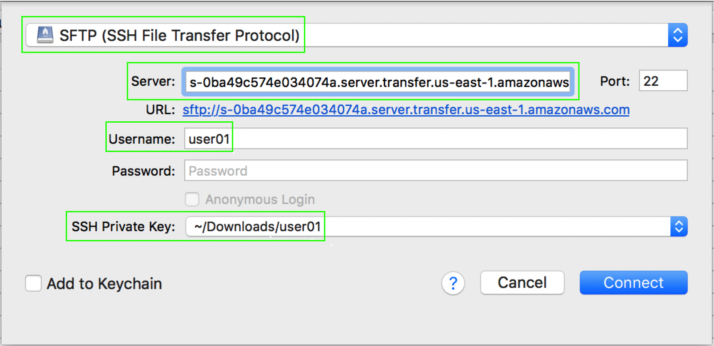

1.	Utilice un programa de SFTP como [**_FileZilla_**](https://filezilla-project.org/download.php) o [**_Cyberduck_**](https://cyberduck.io/download/) para conectarse al servidor SFTP utilizando el nombre del usuario que creó (**_user01_**) y la **_llave privada_** que generó anteriormente (no se requiere contraseña). La dirección del servidor es el valor de **_Endpoint_** que guardó en el editor de texto.

2. Una vez conectado navegue a través de los directorios y comience a subir archivos.
3. Verifique que efectivamente su(s) usuario(s) solamente tiene(n) acceso a su folder.
4. Regrese al servicio de S3 en la consola de AWS https://s3.console.aws.amazon.com/s3/ .
5. Vaya al bucket que creó inicialmente y verifique como es que los archivos que subió por medio del servidor SFTP se encuentran ahí.

Fin del laboratorio
