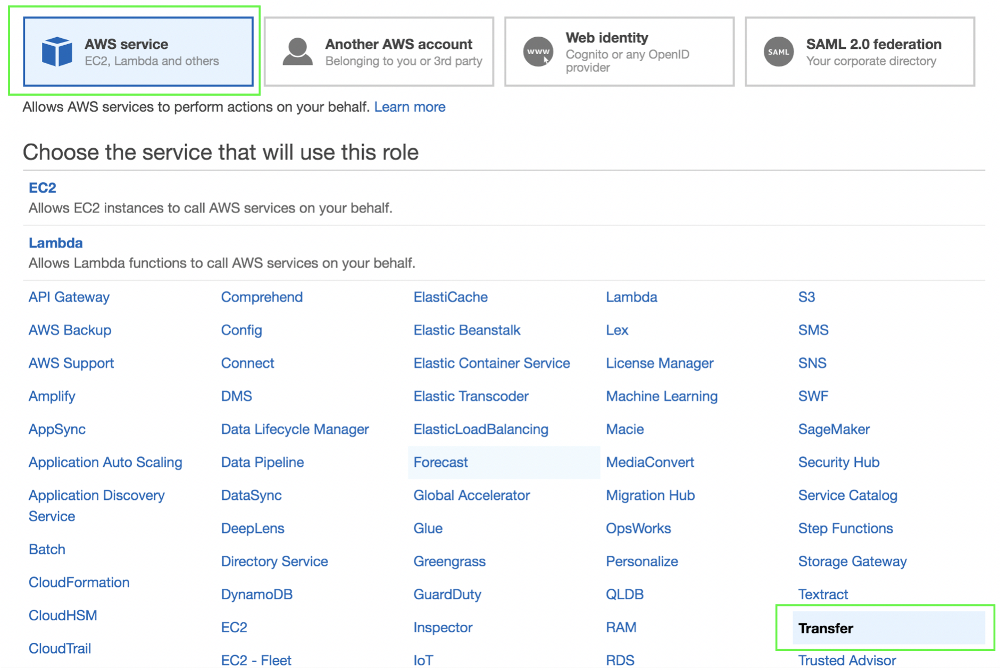

1.	Diríjase de nuevo al servicio de **_IAM_** (https://console.aws.amazon.com/iam/) 
2.	Haga click en **_Roles_** en el menú del lado izquierdo.
3.	Haga click en **_Create role_**.
4.	En **_Select type of trusted entity_** asegúrese que esté seleccionado **_AWS service_**.
5.	En ****Choose the service that will use this role_** seleccione **_Transfer_**.

6.	Haga click en **_Next: Permissions_**.
7.	En el campo de **_Filter policies_** ingrese el nombre de la primera política que creó en el módulo anterior (**_AWSTransferCustomPolicy_**).
8.	Seleccione la política (**_AWSTransferCustomPolicy_**) y haga click en **_Next: Tags_**.
9.	Haga click en **_Next: Review_**.
10.	Ingrese un nombre para su rol en el campo de **_Role name_** (**_AWSTransferCustomRole_**).
11.	Haga click en **_Create role_**.
