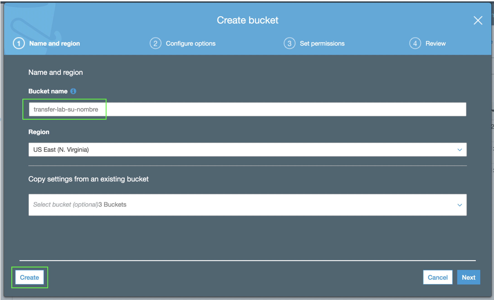
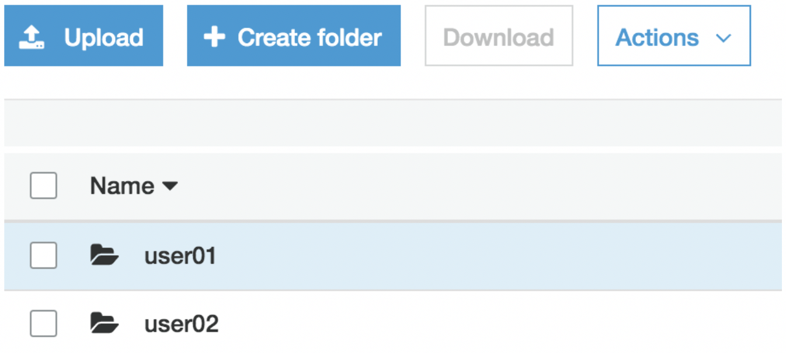

Lo primero que debe hacer es crear un bucket en S3. En este bucket es donde se van a almacenar sus archivos por medio del servicio de AWS Transfer for SFTP.

Haga click en Services y posteriormente seleccione el servicio de S3 el cual se encuentra bajo la categoría de Storage (https://s3.console.aws.amazon.com/).

1. Haga click en **_+ Create bucket_**.
2. Ingrese un nombre para su bucket en Bucket name con la siguiente nomenclatura: **_transfer-lab-<su-nombre>_**, ejemplo: **_transfer-lab-tony-stark_**.
3. Haga click en **_Create_**.

4. Haga click en el bucket que acaba de crear.
5. Haga click en **_+ Create folder_** y cree un folder llamado **_user01_**.
6. Repita el paso anterior y cree otro folder llamado **_user02_**. Al final su bucket debe verse así:

