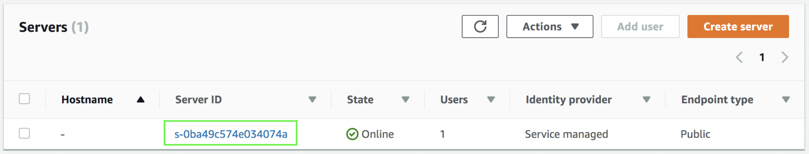

1. Diríjase al servicio de **_AWS Transfer for SFTP_** localizado en:
**_https://console.aws.amazon.com/transfer/_**
2. Haga click en **_Create server_**.
3. En **_Endpoint type_** seleccione **_Public_**.
4. En **_Identity provider_** seleccione **_Service managed_**.
5. Haga click en **_Create server_**.
6. En la siguiente pantalla verá como su servidor se está iniciando (**_State = Starting_**). 
7. Haga click en el valor de **_Server ID_**.

8. Copie el valor de **_Endpoint_** (algo así como s-0ba49c574e034074a.server.transfer.us-east-1.amazonaws.com) y guárdelo en un editor de texto ya que lo necesitará más tarde para conectarse a su servidor SFTP.