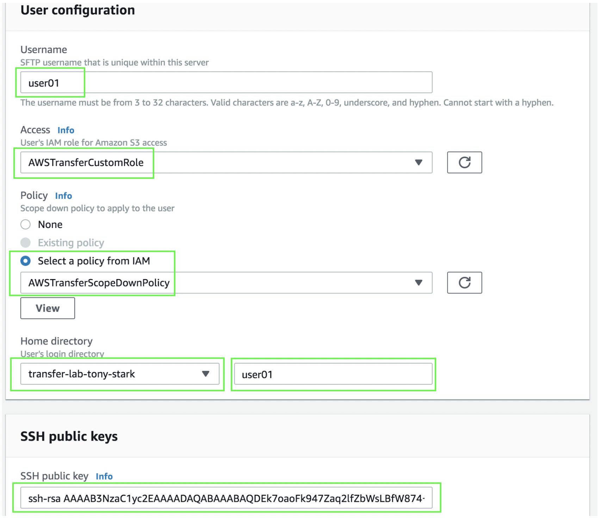

1. Diríjase al servicio de **_AWS Transfer for SFTP_** localizado en:
**_https://console.aws.amazon.com/transfer/_**
2. Seleccione el servidor que creó anteriormente y haga click en **_Add user_**.
3. En el campo de **_Username_** escriba **_user01_**.
4. En **_Access_** seleccione el rol que creó (**_AWSTransferCustomRole_**) del menú desplegable.
5. En **_Policy_** seleccione **_Select policy from IAM_** y del menu desplegable seleccione la segunda política que creó (**_AWSTransferScopeDownPolicy_**).
6. En **_Home directory_** seleccione el bucket que creó (**_transfer-lab-<su-nombre>_**).
7. En el campo de **_Enter optional folder_** escriba **_user01_** (que es el nombre del usuario que está creando y del folder que creó dentro del bucket de S3).
8. En el campo de **_SSH public key_** debe ingresar una llave pública generada por usted.  Si usted es usuario de Windows puede aprender como generar llaves con puttygen siguiendo esta liga
9. **_https://www.ssh.com/ssh/putty/windows/puttygen_**. Si usted es usuario de Linux/Mac, ejecute el siguiente comando en terminal sustituyendo **_key_name_** por el nombre que guste dar a su llave (puede ser el nombre del usuario que está creando):

> ssh-keygen -P "" -f **_key_name_**

En ambos casos la llave pública se verá como algo así:

> ssh-rsa AAAAB3NzaC1yc2EAAAADAQABAAABAQDEk7oaoFk947Zaq2lfZbWsLBfW874+hn8ZPFIt+s3Zt5tOW72ZocCbuq6KsyzS4AMCSfeKEEVMWaTpm5oZaFbcTJRfDF55DvsV2gezJwH1l5pWMRjqtQ9BeH6V7sxrelU66YL4CvollCt23WfIV8rJybfrr7zsPglMVZSGxfhHA88Oi9s3XYqfZx7w4edAkG9+WtiEx3bmPDTt1FaZlB+L9cUCEBnn3af39RR9EfbKzRAtLQ7W8t3uFlg5wG92fKcVQbl4BOBvOuox+M81tuxhGSonRrO/7pwRYLncYoscF7nT7yaN/7yrJtWFr3jWN7M9tFP8Hg3ZIx1tU5h9kN+v

Al final, la pantalla de creación de usuario debe verse así:

9. Haga click en **_Add_**.
10. **_Opcional:_** repita los pasos a de este módulo para crear un segundo usuario (user02).
